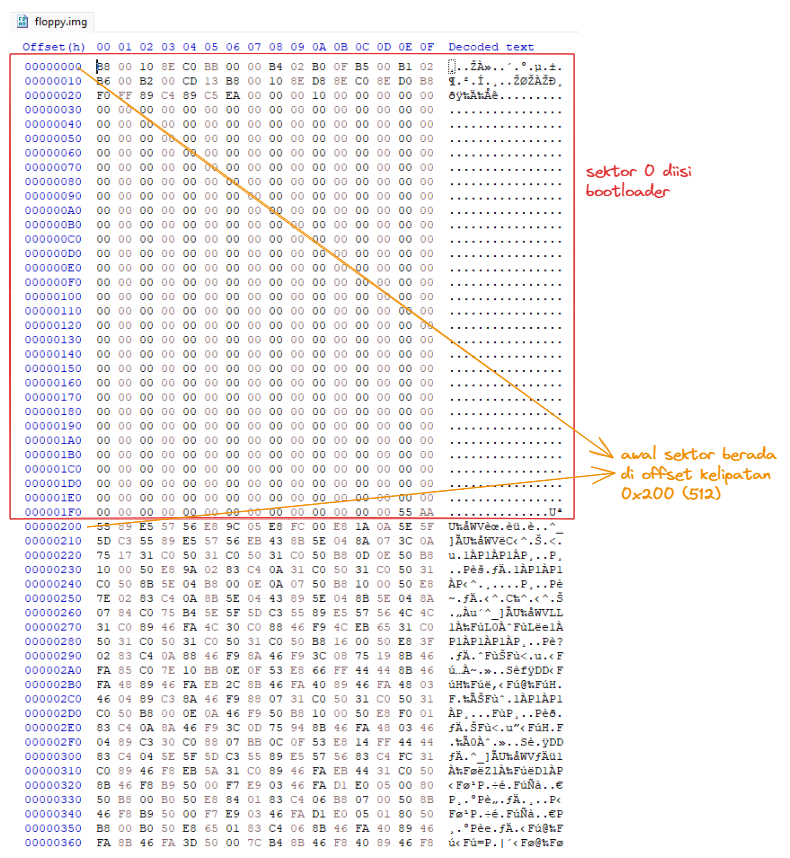
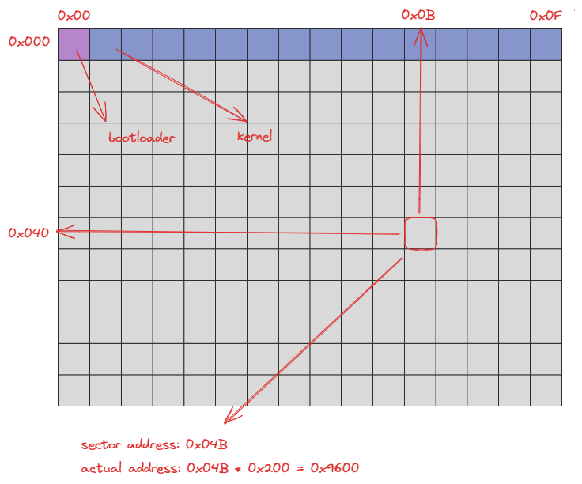
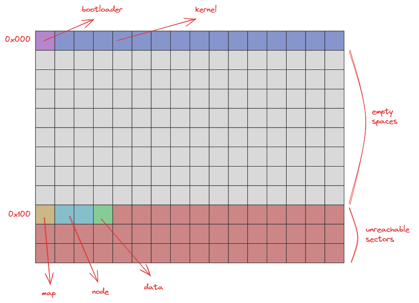
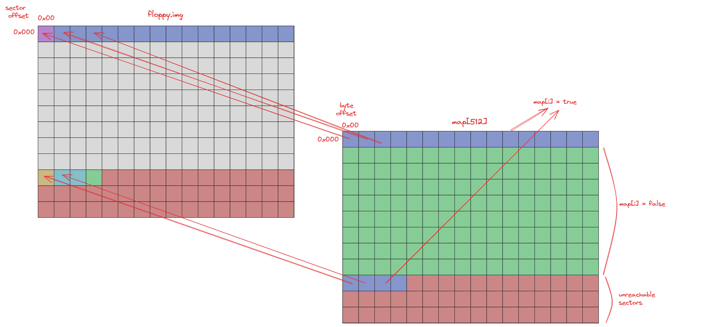
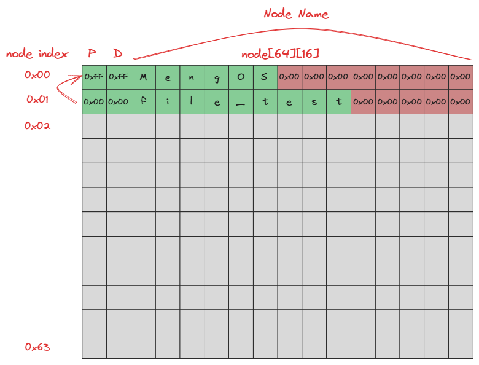
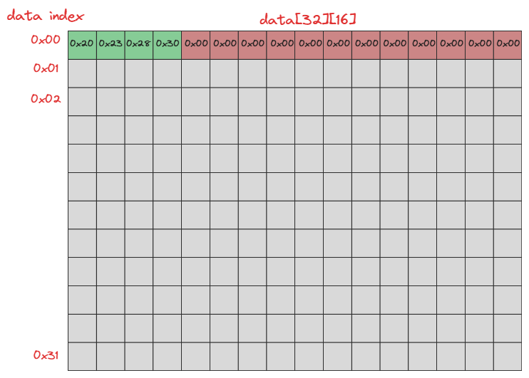
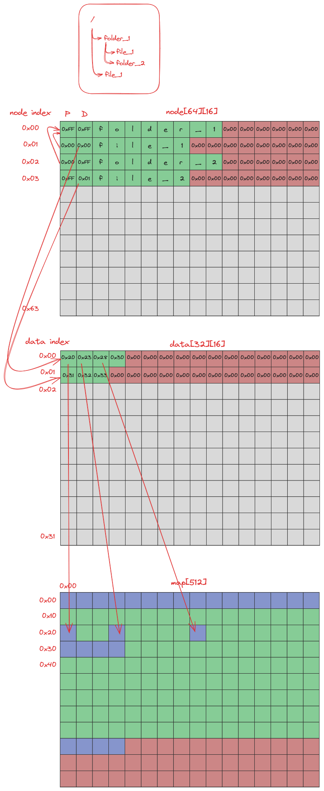
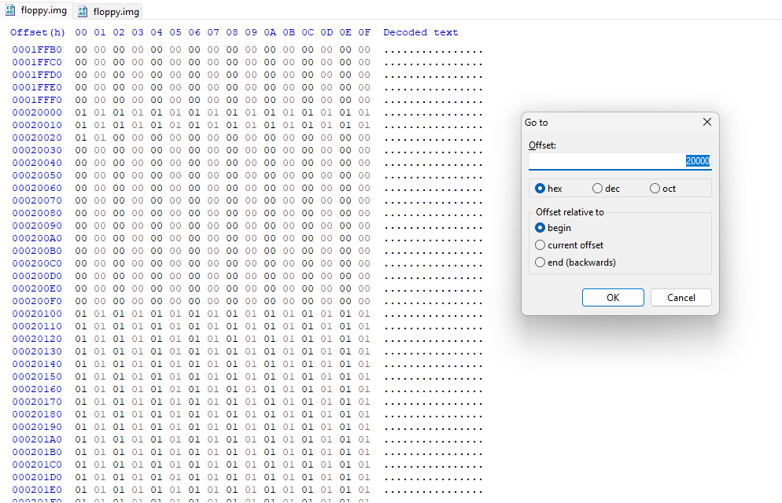

# MengOS

Apa??? Bikin kernel lagi???? :(

[Looking for the English version?](./README-EN.md)

###  Pengenalan

Pada final praktikum, kita akan melanjutkan `task-4` dari praktikum modul 4 yang sebelumnya. Kali ini, kita akan membuat sebuah filesystem sederhana yang dapat digunakan untuk menyimpan file-file yang kita buat. Filesystem yang akan kita buat ini akan menggunakan metode penyimpanan data yang sederhana, yaitu dengan menyimpan data file ke dalam blok-blok yang telah disediakan oleh filesystem. Jika kalian sudah tidak sabar ingin langsung mengerjakan task-task yang ada, bisa search `TODO` pada workspace ini. Berikut adalah gambaran yang akan kalian kerjakan pada final praktikum kali ini.

- Membuat filesystem yang dapat digunakan untuk menyimpan file-file yang kita buat.
- Melengkapi kernel untuk dapat membaca dan menulis file ke dalam filesystem yang telah kita buat.
- Membuat shell sederhana yang dapat digunakan untuk mengakses filesystem yang telah kita buat.

###  Pencerdasan

Penjelasan pada praktikum final akan sering menggunakan angka heksadesimal. Penggunaan angka heksadesimal ditandai dengan prefix `0x`. Jika kalian belum terbiasa dengan angka heksadesimal, kalian dapat menggunakan kalkulator yang mendukung mode heksadesimal atau menggunakan konversi angka heksadesimal ke desimal.

### # Struktur Disk

Jika kalian sudah melewati modul 4, pasti sudah tidak asing lagi dengan struktur disk yang akan kita gunakan. Disk yang kita gunakan terdiri dari beberapa blok. Selanjutnya blok akan disebut sektor. Setiap sektor memiliki ukuran 512 bytes. Sektor pertama akan digunakan sebagai boot sector, yang berisi hasil kompilasi dari `bootloader.asm`. Sektor kedua hingga sektor ke-15 akan digunakan untuk menyimpan kode teks dari kernel yang kita buat.

Dengan melihat hasil dari modul 4, berikut adalah struktur disk yang akan kita gunakan. Dapat dilihat menggunakan aplikasi seperti `HxD` atau menggunakan perintah `hexdump` atau `xxd`.



Untuk memudahkan dalam ilustrasi selanjutnya, struktur disk akan digambarkan sebagai berikut.



Satu sektor akan digambarkan sebagai satu blok. Alamat sektor akan dinomori ulang dari `0x00`. Sehingga sektor pertama akan memiliki alamat `0x00`, sektor kedua akan memiliki alamat `0x01`, dan seterusnya. Satu baris akan berisi 16 sektor. Sehingga baris pertama akan berisi sektor dengan alamat `0x00` hingga `0x0F`, baris kedua akan berisi sektor dengan alamat `0x10` hingga `0x1F`, dan seterusnya.

Untuk mencari alamat sektor pada isi file `floppy.img`, kita dapat mengonversi alamat sektor ke dalam alamat byte dengan cara seperti pada gambar di atas.

### # Struktur Filesystem

Filesystem yang akan dibuat akan menggunakan beberapa komponen, yaitu map, node, dan data. Map akan disimpan sebanyak 1 sektor pada sektor `0x100`. Node akan disimpan sebanyak 2 sektor pada sektor `0x101` dan `0x102`. Data akan disimpan sebanyak 1 sektor pada sektor `0x103`.

Berikut adalah ilustrasi dari struktur filesystem yang akan kita buat.



### # Struktur Filesystem Map

Map akan digunakan untuk menandai blok-blok pada disk yang telah digunakan oleh file. Setiap blok akan memiliki status `0x00` jika sektor yang bersangkutan belum digunakan, dan `0x01` jika sektor yang bersangkutan telah digunakan. Contohnya, karena pada sektor `0x00` telah digunakan oleh bootloader, maka isi dari map ke-0 adalah `0x01`. Komponen map akan digunakan ketika kita ingin menulis file ke dalam disk untuk mengetahui sektor mana saja yang dapat kita gunakan.

Berikut adalah ilustrasi dari komponen map.



Map akan berukuran 1 sektor (512 bytes). Item ke-0 hingga item ke-15 pada map akan memiliki status `0x01` karena telah digunakan oleh sistem operasi. Item ke-16 hingga item ke-255 akan memiliki status `0x00` karena belum digunakan. Mulai dari item ke-256 (`0x100`) hingga item ke 511 (`0x1FF`) akan ditandai sebagai sektor yang telah digunakan. Hal ini dikarenakan kita tidak memperbolehkan file untuk menulis data pada sektor yang berada di atas sektor `0x100`.

### # Struktur Filesystem Node

Node akan digunakan untuk menyimpan informasi dari file atau direktori yang kita buat. Setiap node akan memiliki ukuran 16 bytes. Sehingga, total akan terdapat 64 item node yang bisa disimpan. Berikut adalah ilustrasi dari komponen node.



Berikut adalah penjelasan dari setiap item pada node.

- **P**: kolom pertama pada item node berguna sebagai penunjuk _parent node_ dari node yang bersangkutan dan akan bernilai `0xFF` jika parent dari node yang bersangkutan adalah _root node_.

  Sebagai contoh, pada node index ke-1, nilai dari kolom pertama adalah `0x00`. Hal ini menunjukkan bahwa node index ke-1 adalah _parent node_ dari node index ke-0. Sedangkan pada node index ke-0, nilai dari kolom pertama adalah `0xFF`. Hal ini menunjukkan bahwa _parent node_ dari node index ke-0 adalah _root node_.

- **D**: kolom kedua pada item node berguna sebagai penunjuk index dari komponen data yang akan digunakan untuk menyimpan data file. Jika nilai dari kolom kedua adalah `0xFF`, maka node tersebut merupakan direktori.

  Sebagai contoh, pada node index ke-0, nilai dari kolom kedua adalah `0x00`. Hal tersebut berarti informasi data dari file tersebut bisa diakses pada komponen data index ke-0. Sedangkan pada node index ke-1, nilai dari kolom kedua adalah `0xFF`. Hal tersebut berarti node tersebut merupakan direktori.

- **Node name**: kolom ketiga hingga kolom terakhir pada item node berguna sebagai nama dari node tersebut. Nama dari node akan memiliki panjang maksimal 13 karakter (karakter terakhir adalah karakter null).

### # Struktur Filesystem Data

Komponen data akan digunakan untuk petunjuk sektor-sektor yang digunakan untuk menyimpan data file. Setiap item data akan memiliki ukuran 16 bytes. Sehingga, total akan terdapat 32 item data yang bisa disimpan. Berikut adalah ilustrasi dari komponen data.



Setiap kolom pada item data akan menunjukkan alamat sektor yang digunakan untuk menyimpan data file. Karena satu byte hanya dapat menunjukkan alamat sektor hingga 255 (`0xFF`), maka kita hanya dapat menyimpan alamat sektor hingga sektor `0xFF`. Oleh karena itu, item map ke-256 hingga akhir akan ditandai sebagai sektor yang telah digunakan.

### # Ilustrasi Filesystem

Berikut adalah ilustrasi dari ketiga komponen filesystem yang telah dijelaskan sebelumnya.



###  Instruksi Pengerjaan

### # Task 1 - Membuat syscall readSector dan writeSector

Pada task ini, kalian diminta untuk membuat syscall `readSector` dan `writeSector` yang akan digunakan untuk membaca dari disk ke memory dan menulis dari memory ke disk.

Berikut adalah implementasi dari `readSector` dan penjelasannya.

```c
void readSector(byte* buf, int sector) {
  int ah = 0x02;                    // read sector service number
  int al = 0x01;                    // number of sectors to read
  int ch = div(sector, 36);         // cylinder number
  int cl = mod(sector, 18) + 1;     // sector number
  int dh = mod(div(sector, 18), 2); // head number
  int dl = 0x00;                    // drive number

  interrupt(
    0x13,
    ah << 8 | al,
    buf,
    ch << 8 | cl,
    dh << 8 | dl
  );
}
```

- Interrupt vector yang akan digunakan adalah `0x13` untuk melakukan operasi disk I/O.

- Register `ah` akan diisi dengan `0x02` yang menunjukkan operasi `read`.

- Register `al` akan diisi dengan `0x01` yang menunjukkan jumlah sektor yang akan dibaca.

- Register `ch` dan `cl` akan diisi dengan nomor cylinder dan sector yang akan dibaca.

  Pada floppy disk, terdapat 2 head, 18 sector per track, dan 36 track per cylinder. Sehingga, nomor cylinder akan dihitung dengan membagi nomor sektor dengan 36. Sedangkan nomor sector akan dihitung dengan mengambil sisa pembagian nomor sektor dengan 18 dan ditambahkan dengan 1.

- Register `dh` dan `dl` akan diisi dengan nomor head dan drive yang akan digunakan.

  Pada floppy disk, terdapat 2 head. Sehingga, nomor head akan dihitung dengan membagi nomor sektor dengan 18 dan mengambil sisa pembagian dengan 2. Sedangkan nomor drive akan diisi dengan `0x00` yang menunjukkan drive pertama.

Untuk `writeSector`, kalian dapat menggunakan implementasi yang sama dengan `readSector` dengan mengganti nilai register `ah` dengan `0x03` yang menunjukkan operasi `write`.

### # Task 2 - Implementasi fsRead

Pada [`filesystem.h`](./src/filesystem.h), terdapat beberapa konstanta dan tipe data yang akan digunakan untuk membantu dalam implementasi filesystem. Kalian diminta untuk mengimplementasikan fungsi `fsRead` yang akan digunakan untuk membaca direktori atau file dari filesystem. Fungsi `fsRead` akan menerima parameter sebagai berikut.

```c
void fsRead(struct file_metadata* metadata, enum fs_return* status);
```

- `metadata` adalah pointer ke `file_metadata` yang akan digunakan untuk menyimpan informasi dari file atau direktori yang akan dibaca.

  Struktur `file_metadata` akan memiliki struktur sebagai berikut.

  ```c
  struct file_metadata {
    byte parent_index;
    unsigned int filesize;
    char node_name[MAX_FILENAME];
    byte buffer[FS_MAX_SECTOR * SECTOR_SIZE];
  };
  ```

  - `parent_index` adalah index dari _parent node_ dari file atau direktori yang akan dibaca.
  - `filesize` adalah ukuran dari file yang akan dibaca. `filesize` berisi 0 dalam pemanggilan fungsi `fsRead`.
  - `node_name` adalah nama dari file atau direktori yang akan dibaca.
  - `buffer` adalah pointer ke buffer yang akan digunakan untuk menyimpan data dari file atau direktori yang akan dibaca. `buffer` berisi `0x00` dalam pemanggilan fungsi `fsRead`.

- `status` adalah pointer ke `fs_return` yang akan digunakan untuk menyimpan status dari operasi yang dilakukan.

Langkah-langkah yang harus dilakukan pada fungsi `fsRead` adalah sebagai berikut.

1. Membaca filesystem dari disk ke memory.

2. Iterasi setiap item node untuk mencari node yang memiliki nama yang sesuai dengan `metadata->node_name` dan parent index sesuai dengan `metadata->parent_index`.

3. Jika node yang dicari tidak ditemukan, maka set `status` dengan `FS_R_NODE_NOT_FOUND`.

4. Jika node yang ditemukan adalah direktori, maka set `status` dengan `FS_R_TYPE_IS_DIRECTORY`.

5. Jika node yang ditemukan adalah file, maka proses selanjutnya adalah sebagai berikut.

   - Set `metadata->filesize` dengan 0.
   - Lakukan iterasi i dari 0 hingga `FS_MAX_SECTOR`
   - Jika data index ke-i dari node yang ditemukan adalah `0x00`, maka hentikan iterasi.
   - Lakukan `readSector` untuk membaca data dari sektor yang ditunjuk oleh data pada _data index_ dengan sectors ke-i disimpan ke dalam `metadata->buffer + i * SECTOR_SIZE`.
   - Tambahkan `SECTOR_SIZE` ke `metadata->filesize`.

6. Set `status` dengan `FS_R_SUCCESS`.

### # Task 3 - Implementasi fsWrite

Selanjutnya kalian diminta untuk mengimplementasikan fungsi `fsWrite` yang akan digunakan untuk menulis file ke dalam filesystem. Fungsi `fsWrite` akan menerima parameter yang sama dengan `fsRead` sebagai berikut.

```c
void fsWrite(struct file_metadata* metadata, enum fs_return* status);
```

Pada fungsi `fsWrite`, `metadata` yang diterima akan berisi informasi berikut.

- `parent_index` adalah index dari _parent node_ dari file yang akan ditulis. Jika `parent_index` adalah `0xFF`, maka file yang akan ditulis akan disimpan pada _root directory_.
- `filesize` adalah ukuran dari file yang akan ditulis. Jika `filesize` adalah 0, maka file yang akan ditulis adalah direktori.
- `node_name` adalah nama dari file yang akan ditulis.
- `buffer` adalah pointer ke buffer yang berisi data dari file yang akan ditulis.

Langkah-langkah yang harus dilakukan pada fungsi `fsWrite` adalah sebagai berikut.

1. Membaca filesystem dari disk ke memory.

2. Lakukan iterasi setiap item node untuk mencari node yang memiliki nama yang sama dengan `metadata->node_name` dan parent index yang sama dengan `metadata->parent_index`. Jika node yang dicari ditemukan, maka set `status` dengan `FS_R_NODE_ALREADY_EXISTS` dan keluar.

3. Selanjutnya, cari node yang kosong (nama node adalah string kosong) dan simpan index-nya. Jika node yang kosong tidak ditemukan, maka set `status` dengan `FS_W_NO_FREE_NODE` dan keluar.

4. Iterasi setiap item data untuk mencari data yang kosong (alamat sektor data ke-0 adalah `0x00`) dan simpan index-nya. Jika data yang kosong tidak ditemukan, maka set `status` dengan `FS_W_NO_FREE_DATA` dan keluar.

5. Iterasi setiap item map dan hitung blok yang kosong (status blok adalah `0x00` atau `false`). Jika blok yang kosong kurang dari `metadata->filesize / SECTOR_SIZE`, maka set `status` dengan `FS_W_NOT_ENOUGH_SPACE` dan keluar.

6. Set nama dari node yang ditemukan dengan `metadata->node_name`, parent index dengan `metadata->parent_index`, dan data index dengan index data yang kosong.

7. Lakukan penulisan data dengan cara sebagai berikut.

   - Buatlah variabel counter yang akan digunakan untuk menghitung jumlah sektor yang telah ditulis (akan disebut dengan j).

   - Lakukan iterasi i dari 0 hingga `SECTOR_SIZE`.

   - Jika item map pada index ke-i adalah `0x00`, maka tulis index i ke dalam data item sektor ke-j dan tulis data dari buffer ke dalam sektor ke-i.

   - Penulisan dapat menggunakan fungsi `writeSector` dari `metadata->buffer + i * SECTOR_SIZE`.

   - Tambahkan 1 ke j.

8. Tulis kembali filesystem yang telah diubah ke dalam disk.

9. Set `status` dengan `FS_W_SUCCESS`.

### # Task 4 - Implementasi printCWD

Setelah berhasil mengimplementasikan fungsi `fsRead` dan `fsWrite`, selanjutnya adalah pembuatan shell sederhana. Shell akan menggunakan read-eval-print-loop (REPL) yang akan menerima perintah dari user dan mengeksekusi perintah tersebut. Pada task ini, kalian diminta untuk mengimplementasikan fungsi `printCWD` yang akan digunakan untuk menampilkan _current working directory_ (CWD) dari shell.

Fungsi `printCWD` akan menerima parameter `byte cwd` yang menunjukkan node index dari _current working directory_. Fungsi akan menampilkan path dari root (`/`) hingga node yang ditunjuk oleh `cwd`. Jika `cwd` adalah `0xFF`, maka path yang ditampilkan adalah `/`. Setiap node yang ditampilkan akan dipisahkan oleh karakter `/`.

### # Task 5 - Implementasi parseCommand

Selanjutnya, kalian diminta untuk mengimplementasikan fungsi `parseCommand` yang akan digunakan untuk memisahkan perintah yang diberikan oleh user. Fungsi `parseCommand` akan menerima parameter sebagai berikut.

```c
void parseCommand(char* buf, char* cmd, char arg[2][64]);
```

- `buf` adalah string yang berisi perintah yang diberikan oleh user.
- `cmd` adalah string yang akan digunakan untuk menyimpan perintah yang diberikan oleh user.
- `arg` adalah array of string yang akan digunakan untuk menyimpan argumen dari perintah yang diberikan oleh user.

Karena hanya akan ada 2 argumen yang diberikan oleh user, maka `arg` akan memiliki ukuran 2. Jika argumen yang diberikan oleh user adalah 1, maka `arg[1]` akan berisi string kosong. Jika argumen yang diberikan oleh user adalah 0, maka `arg[0]` dan `arg[1]` akan berisi string kosong.

### # Task 6 - Implementasi cd

Fungsi `cd` akan digunakan untuk mengubah _current working directory_ dari shell. Berikut adalah spesifikasi dari fungsi `cd`.

- `cd <dirname>` dapat memindahkan _current working directory_ ke direktori yang berada di bawah _current working directory_.

- `cd ..` akan memindahkan _current working directory_ ke _parent directory_ dari _current working directory_.

- `cd /` akan memindahkan _current working directory_ ke _root directory_.

- `cd` hanya dapat memindahkan _current working directory_ ke direktori, tidak dapat memindahkan _current working directory_ ke file.

- Implementasi relative path dan absolute path tidak diwajibkan.

### # Task 7 - Implementasi ls

Fungsi `ls` akan digunakan untuk menampilkan isi dari direktori. Berikut adalah spesifikasi dari fungsi `ls`.

- `ls` akan menampilkan isi dari _current working directory_.

- `ls .` akan menampilkan isi dari _current working directory_.

- `ls <dirname>` akan menampilkan isi dari direktori yang berada di bawah _current working directory_.

- `ls` hanya dapat menampilkan isi dari direktori, tidak dapat menampilkan isi dari file.

- Implementasi relative path dan absolute path tidak diwajibkan.

### # Task 8 - Implementasi mv

Fungsi `mv` akan digunakan untuk memindahkan file atau direktori. Berikut adalah spesifikasi dari fungsi `mv`.

- `mv <filename> <dirname>/<outputname>` akan memindahkan file yang berada di bawah _current working directory_ ke direktori yang berada di bawah _current working directory_.

- `mv <filename> /<outputname>` akan memindahkan file yang berada di bawah _current working directory_ ke direktori _root directory_.

- `mv <filename> ../<outputname>` akan memindahkan file yang berada di bawah _current working directory_ ke _parent directory_ dari _current working directory_.

- `mv` hanya dapat memindahkan file, tidak dapat memindahkan direktori.

- Implementasi relative path dan absolute path tidak diwajibkan.

### # Task 9 - Implementasi cp

Fungsi `cp` akan digunakan untuk menyalin file. Berikut adalah spesifikasi dari fungsi `cp`.

- `cp <filename> <dirname>/<outputname>` akan menyalin file yang berada di bawah _current working directory_ ke direktori yang berada di bawah _current working directory_.

- `cp <filename> /<outputname>` akan menyalin file yang berada di bawah _current working directory_ ke direktori _root directory_.

- `cp <filename> ../<outputname>` akan menyalin file yang berada di bawah _current working directory_ ke _parent directory_ dari _current working directory_.

- `cp` hanya dapat menyalin file, tidak dapat menyalin direktori.

- Implementasi relative path dan absolute path tidak diwajibkan.

### # Task 10 - Implementasi cat

Fungsi `cat` akan digunakan untuk menampilkan isi dari file. Berikut adalah spesifikasi dari fungsi `cat`.

- `cat <filename>` akan menampilkan isi dari file yang berada di bawah _current working directory_.

- Implementasi relative path dan absolute path tidak diwajibkan.

### # Task 11 - Implementasi mkdir

Fungsi `mkdir` akan digunakan untuk membuat direktori. Berikut adalah spesifikasi dari fungsi `mkdir`.

- `mkdir <dirname>` akan membuat direktori yang berada di bawah _current working directory_.

###  Testing

Untuk melakukan testing, kalian dapat menjalankan `make build run` pada terminal untuk melakukan kompilasi dan menjalankan OS. Setelah itu tutup OS dan jalankan `make generate test=1` untuk melakukan populasi file dan direktori ke dalam filesystem (ubah nilai 1 dengan nomor test yang sesuai). Setelah itu, jalankan kembali OS dengan `make run` dan coba perintah shell yang telah kalian implementasikan.

### # `make generate test=1`

Berikut adalah struktur filesystem yang akan digunakan pada test ini.

```
/
├─ dir1
│  ├─ dir1-1
│  │  └─ dir1-1-1
│  └─ dir1-2
│     └─ dirname
├─ dir2
│  └─ dirname
└─ dir3
```

### # `make generate test=2`

Berikut adalah struktur filesystem yang akan digunakan pada test ini.

```
/
├─ file-0
├─ dir-1
│  └─ dir-2
│     └─ . . .
│        └─ dir-62
└─ file-63
```

### # `make generate test=3`

Berikut adalah struktur filesystem yang akan digunakan pada test ini.

```
/
├─ 1024
├─ 4096
├─ 8192_0
├─ 8192_1
├─ ...
└─ 8192_13
```

### # `make generate test=4`

Berikut adalah struktur filesystem yang akan digunakan pada test ini.

```
/
├─ dir1
│  ├─ katanya
│  ├─ dir3
│  │  ├─ bikin
│  │  ├─ fp
│  │  └─ dir4
│  ├─ dir5
│  │  ├─ cuma
│  │  └─ seminggu
├─ dir2
└─ doang
```

###  Tips

- Untuk debugging filesystem, kalian dapat mengecek menggunakan hexedit pada Linux atau HxD pada Windows. Dengan informasi sektor map `0x100`, node `0x101` dan `0x102`, serta data `0x103`, kalian dapat mengetahui data yang tersimpan pada filesystem. Untuk mendapatkan offset byte dari sektor, kalian dapat menggunakan rumus `offset = sektor * 512` atau `offset = sektor * 0x200`. Sebagai contoh untuk mengetahui isi dari filesystem map, dapat membuka HxD dan hexedit dengan menekan `Ctrl + G` dan memasukkan offset byte dari sektor map (`0x100 * 0x200 = 0x20000`).

  

- `bcc` tidak memberikan error checking sebanyak `gcc`. Kalian dapat menggunakan `gcc` untuk melakukan error checking pada saat kompilasi.

- Dikarenakan penggunaan `bcc` dengan mode ANSI C, kalian tidak dapat mendeklarasikan variabel di tengah blok kode atau scope. Variabel harus dideklarasikan di awal blok kode atau scope.

- Selalu jalankan `make` pada direktori `praktikum-final`, bukan pada subdirektori.

- Sedikit sneak peek apa yang akan kalian buat.

  https://github.com/sisop-its-s24/praktikum-final/assets/54766683/10055e0d-7a77-44d5-97f5-376bf976d247


# _JAWABAN_ :


### # Task-1 Membuat syscall readSector dan writeSector

### ###  File `kernel.c` :
```bash
// TODO: 1. Implement writeSector function [----------------------------- DONEEEEEEEE -------------------------------------------------]
void writeSector(byte* buf, int sector) {
  int ah = 0x03;  // bedanya disini adalah service number unutk menulis
  int al = 0x01;                    
  int ch = div(sector, 36);         
  int cl = mod(sector, 18) + 1;     
  int dh = mod(div(sector, 18), 2); 
  int dl = 0x00;                    

  // Memanggil interrupt 0x13 dengan nilai register yang ditentukan untuk melakukan operasi tulis
  interrupt(
    0x13,
    ah << 8 | al,
    buf,
    ch << 8 | cl,
    dh << 8 | dl
  );
}

//  intinya kalau 0x02 itu membaca kalau 0x03 itu menulis (sector yang isinya binary)
```


### # Task 2 - Implementasi fsRead

### ###  File `filesystem.c` :
```bash

// TODO: 2. Implement fsRead function [----------------------------- DONEEEEEEEE -------------------------------------------------]

 // Membaca file dari sistem file itu tadi
void fsRead(struct file_metadata* metadata, enum fs_return* status) {
  // Membaca file dari sistem file
  struct node_fs node_fs_buf; // buffer ini untuk metain sistem file nya
  struct data_fs data_fs_buf; // buffer ini untuk data sistem file nya
  int i, j; // ini untuk iterasi

  // buat baca sektor peta sistem file
  readSector(&node_fs_buf, FS_NODE_SECTOR_NUMBER);
  readSector(((byte*)&node_fs_buf) + SECTOR_SIZE, FS_NODE_SECTOR_NUMBER + 1);

  // buat baca sektor data sistem file
  readSector(&data_fs_buf, FS_DATA_SECTOR_NUMBER);

  // temukan node dulu di file
  for (i = 0; i < FS_MAX_NODE; i++) {
    if (node_fs_buf.nodes[i].parent_index == metadata->parent_index &&
        strcmp(node_fs_buf.nodes[i].node_name, metadata->node_name)) {
      if (node_fs_buf.nodes[i].data_index == FS_NODE_D_DIR) {
        // Jika node adalah direktori
        *status = FS_R_TYPE_IS_DIRECTORY;
        return;
      }

      // buat baca sektor data dari file
      for (j = 0; j < FS_MAX_SECTOR && data_fs_buf.datas[node_fs_buf.nodes[i].data_index].sectors[j] != 0; j++) {
        readSector(metadata->buffer + (j * SECTOR_SIZE), data_fs_buf.datas[node_fs_buf.nodes[i].data_index].sectors[j]);
      }

      // ini untuk ngitung ukuran file nya berapa byte 
      metadata->filesize = j * SECTOR_SIZE;

      // ini untuk nandai file nya ketemu dan udah berhasil baca dengan status sukses
      *status = FS_SUCCESS;
      return;
    }
  }

  *status = FS_R_NODE_NOT_FOUND;
}
```


### # Task 3 - Implementasi fsWrite

### ###  File `filesystem.c` :
```bash
// TODO: 3. Implement fsWrite function [----------------------------- DONEEEEEEEE -------------------------------------------------]
// Menulis file ke sistem file nya
void fsWrite(struct file_metadata* metadata, enum fs_return* status) {
  struct map_fs map_fs_buf; // Buffer untuk peta sistem file
  struct node_fs node_fs_buf; // Buffer untuk node ny pda sistem file
  struct data_fs data_fs_buf; // Buffer untuk datanya pd sistem file
  int i, j, k, free_node_index = -1, free_data_index = -1;
  bool found = false;

// baca sektor jika digunakan user (Membaca sektor peta, node, dan data sistem file)
  readSector(&map_fs_buf, FS_MAP_SECTOR_NUMBER);
  readSector(&node_fs_buf, FS_NODE_SECTOR_NUMBER);
  readSector(((byte*)&node_fs_buf) + SECTOR_SIZE, FS_NODE_SECTOR_NUMBER + 1);
  readSector(&data_fs_buf, FS_DATA_SECTOR_NUMBER);
  for (i = 0; i < FS_MAX_NODE; i++) {
    if (node_fs_buf.nodes[i].parent_index == 0x00 && node_fs_buf.nodes[i].data_index == 0x00) {
      free_node_index = i;
      break;
    }
  }

  // cari node yang kosong (spasi, null dan lain lain tidak dibaca byte)
  if (free_node_index == -1) {
    // ngga ada node kosong
    *status = FS_W_NO_FREE_NODE;
    return;
  }

  // nyari data yang kosong 
  for (i = 0; i < FS_MAX_DATA; i++) {
    if (map_fs_buf.is_used[i] == false) {
      free_data_index = i;
      break;
    }
  }

  if (free_data_index == -1) {
    // ini buat nandai tidak ada data kosong 
    *status = FS_W_NO_FREE_DATA;
    return;
  }

  // Menulis data ke sektor
  for (j = 0; j < FS_MAX_SECTOR && j * SECTOR_SIZE < metadata->filesize; j++) {
    for (k = 0; k < SECTOR_SIZE; k++) {
      data_fs_buf.datas[free_data_index].sectors[j] = j + 1;
      writeSector(metadata->buffer + (j * SECTOR_SIZE), data_fs_buf.datas[free_data_index].sectors[j]);
    }
  }

  // isi info node menggunakan metadata 
  node_fs_buf.nodes[free_node_index].parent_index = metadata->parent_index;
  node_fs_buf.nodes[free_node_index].data_index = free_data_index;
  strcpy(node_fs_buf.nodes[free_node_index].node_name, metadata->node_name);

  // Tandai sektor jika digunakan user
  map_fs_buf.is_used[free_data_index] = true;

  // Menulis kembali sektor peta, node, dan data  di sistem file
  writeSector(&map_fs_buf, FS_MAP_SECTOR_NUMBER);
  writeSector(&node_fs_buf, FS_NODE_SECTOR_NUMBER);
  writeSector(((byte*)&node_fs_buf) + SECTOR_SIZE, FS_NODE_SECTOR_NUMBER + 1);
  writeSector(&data_fs_buf, FS_DATA_SECTOR_NUMBER);

  *status = FS_SUCCESS; // berhasil menulis file di file sistem nya 
}
```


### # Task 4 - Implementasi printCWD

### ###  File `shell.c` :
```bash
// TODO: 4. Implement printCWD function [----------------------------- DONEEEEEEEE -------------------------------------------------]
void printCWD(byte cwd)
// Fungsi printCWD bakal nerima parameter byte cwd yang nunjukin node index dari folder sekrang , yaitu nampilin path root dari direktori saat ini
{
  struct node_fs node_fs_buf;
  int i;

  // baca sektor
  readSector(&node_fs_buf, FS_NODE_SECTOR_NUMBER);
  readSector(((byte *)&node_fs_buf) + SECTOR_SIZE, FS_NODE_SECTOR_NUMBER + 1);

  // Jika direktori saat ini adalah root, cukup cetak "/"
  if (cwd == FS_NODE_P_ROOT)
  {
    printString("/");
    return;
  }
  // Temukan direktori saat ini dan cetak parent directory terlebih dahulu
  for (i = 0; i < FS_MAX_NODE; i++)
  {
    if (i == cwd)
    {
      // Cetak parent directory terlebih dahulu
      printCWD(node_fs_buf.nodes[i].parent_index);
      printString(node_fs_buf.nodes[i].node_name);
      printString("/");
      return;
    }
  }
}
```


### # Task 5 - Implementasi parseCommand

### ###  File `shell.c` :
```bash
// TODO: 5. Implement parseCommand function [----------------------------- DONEEEEEEEE -------------------------------------------------]
void parseCommand(char *buf, char *cmd, char arg[2][64])
{
  // buf itu string yang berisi perintah yang bakal dipake user
  // cmd itu string yang berisi perintah yang bakal dijalankan
  // arg itu array of string yang berisi argumen dari perintah yang bakal dijalankan

  // variabel i buat index untuk nglacak string buf nya
  // j dan k buat indeks ngisi stringnya cmd dan arg
  int i = 0, j = 0, k = 0;

  // Loop ini bakal jalan selama char pada buf[i] bukan spasi (' ') atau akhir string ('\0), pokok tiap karakter di buf bakal disalin ke cmd, lalu Setelah loop selesai, cmd akan berisi perintah.

  while (buf[i] != ' ' && buf[i] != '\0')
  {
    cmd[j++] = buf[i++];
  }
  cmd[j] = '\0';

  // Skip spasi (' '),
  // semisal ini ada spasi setelah perintah, lewati spasi lalu naikkan nilai i nya (i++)

  if (buf[i] == ' ')
    i++;
  while (buf[i] != ' ' && buf[i] != '\0')
  {
    arg[0][k++] = buf[i++];
  }
  arg[0][k] = '\0';
  if (buf[i] == ' ')
    i++;
  k = 0;
  while (buf[i] != ' ' && buf[i] != '\0')
  {
    arg[1][k++] = buf[i++];
  }
  arg[1][k] = '\0';

  // HINGGA SETERUSNYA SAMPAI KETEMU SPASI ATAU AKHIR STRING MELALU ARGUMEN 0 hingga dan seterusnya

  // Jika hanya ada satu argumen, maka arg[1] akan berisi string kosong.
  // Jika ngga ada argumen, maka arg[0] dan arg[1] akan berisi string kosong

  // contoh nya ni :

  // Misalkan buf berisi string "copy doing doang"
  // cmd akan berisi "copy"
  // arg[0] akan berisi "doang"
  // arg[1] akan berisi "doing"

  // Misalkan buf berisi string "hapus doang"
  // cmd akan berisi "hapus"
  // arg[0] akan berisi "doang"
  // arg[1] akan berisi string kosong

  // Misalkan buf berisi string "balik"
  // cmd akan berisi "balik"
  // arg[0] dan arg[1] akan berisi string kosong
}
```


### # Task 6 - Implementasi cd

### ###  File `shell.c` :
```bash
// TODO: 6. Implement cd function [----------------------------- DONEEEEEEEE -------------------------------------------------]
void cd(byte *cwd, char *dirname)
{
  struct node_fs node_fs_buf;
  int i;
  bool found_dir = false;

  // Jika dirname adalah "." maka tetap di direktori saat ini
  if (strcmp(dirname, ".") == true)
    return;

  // Jika dirname adalah ".." maka pindah ke parent directory
  if (strcmp(dirname, "..") == true)
  {
    // Jika sudah di root, tetap di root
    if (*cwd == FS_NODE_P_ROOT)
      return;

    readSector(&node_fs_buf, FS_NODE_SECTOR_NUMBER);
    readSector(((byte *)&node_fs_buf) + SECTOR_SIZE, FS_NODE_SECTOR_NUMBER + 1);

    *cwd = node_fs_buf.nodes[*cwd].parent_index;
    return;
  }

  // Jika dirname adalah "/" maka pindah ke root directory
  if (strcmp(dirname, "/") == true)
  {
    *cwd = FS_NODE_P_ROOT;
    printString("Already in root...\n");
    return;
  }
  // Membaca node sector dari filesystem
  readSector(&node_fs_buf, FS_NODE_SECTOR_NUMBER);
  readSector(((byte *)&node_fs_buf) + SECTOR_SIZE, FS_NODE_SECTOR_NUMBER + 1);

  // Mencari direktori dengan nama dirname di dalam direktori saat ini
  for (i = 0; i < FS_MAX_NODE; i++)
  {
    if (node_fs_buf.nodes[i].parent_index == *cwd &&
        strcmp(node_fs_buf.nodes[i].node_name, dirname) == true)
    {
      if (node_fs_buf.nodes[i].data_index == FS_NODE_D_DIR)
      {
        *cwd = i;
        found_dir = true;
        break;
      }
    }
  }

  if (!found_dir)
  {
    printString("Dir not found\n");
  }
}
```


### # Task 7 - Implementasi ls

### ###  File `shell.c` :
```bash
// TODO: 7. Implement ls function [----------------------------- DONEEEEEEEE -------------------------------------------------]
void ls(byte cwd, char *dirname)
{
  struct node_fs node_fs_buf;
  // cwd buat dir sekrg (atau folder yang sedang dipakek user)
  byte target_dir = cwd;
  // N itu buat iterasi
  int N;
  // jika ada direktori yang ditemukan
  bool found_dir = false;

  readSector(&(node_fs_buf.nodes[0]), FS_NODE_SECTOR_NUMBER);
  readSector(&(node_fs_buf.nodes[32]), FS_NODE_SECTOR_NUMBER + 1);

  // Jika dirname tidak kosong dan bukan ".", maka cari direktori dengan nama dirname
  if (dirname[0] != '\0' && strcmp(dirname, ".") != true)
  { 
    // perulangan untuk mencari direktori dengan nama dirname
    for (N = 0; N < FS_MAX_NODE; N++)
    {
      if (node_fs_buf.nodes[N].parent_index == cwd &&
          strcmp(node_fs_buf.nodes[N].node_name, dirname))
      {
        if (node_fs_buf.nodes[N].data_index == FS_NODE_D_DIR)
        {
          target_dir = N;
          found_dir = true;
          break;
          // kalau ditemuin keluar dari loop
          // MengOS:/$ ls -> ini dari bool found dir tadi = true
          // MengOS:/$ dir1 dir2 doang -> ini loopingnya
          // MengOS:/$ -> break
        }
      }
    }
    // (ini buat ls folder jika emang gaada folder yang mau dituju misal ls dir7 kalau ngga ada ya directory not found_dir)
    if (!found_dir)
    {
      printString("Invalid select dir\n");
      return;
    }
  }

  // ini validasi looping untuk spasi ls dengan dir aja
  for (N = 0; N < FS_MAX_NODE; N++)
  {
    if (node_fs_buf.nodes[N].parent_index == target_dir)
    {
      printString(node_fs_buf.nodes[N].node_name);
      printString(" "); // ini buat spasi antar direktori
    }
  }
  printString("\n");
}
```


### # Task 8 - Implementasi mv

### ###  File `shell.c` :
```bash
// TODO: 8. Implement mv function [----------------------------- DONEEEEEEEE -------------------------------------------------]
void mv(byte cwd, char *src, char *dst)
{
  struct node_fs node_fs_buf;
  int src_index = -1, dst_index = -1;
  byte target_parent_index = cwd;
  int i;
  bool is_dst_empty = dst[0] == '\0';
  char *dir_name;
  char *file_name;
  bool has_dir = false;

  if (dst[0] == '\0')
  {
    // Tidak melakukan apapun jika filename kosong atau cetak file input nya ngga ada
    printString("Invalid file input\n");
    return;
  }
  // Baca node sector
  readSector(&node_fs_buf, FS_NODE_SECTOR_NUMBER);
  readSector(((byte *)&node_fs_buf) + SECTOR_SIZE, FS_NODE_SECTOR_NUMBER + 1);
  // Cari node sumber
  for (i = 0; i < FS_MAX_NODE; i++)
  {
    if (node_fs_buf.nodes[i].parent_index == cwd &&
        strcmp(node_fs_buf.nodes[i].node_name, src) == true)
    {
      src_index = i;
      break;
    }
  }

  // if (src_index == -1)
  // {
  //   printString("Source file not found_dir\n");
  //   return;
  // }

  // Memastikan sumber bukan direktori
  if (node_fs_buf.nodes[src_index].data_index == FS_NODE_D_DIR)
  {
    printString("Can`t move dir\n");
    return;
  }
  // Jika tujuan adalah root directory
  if (dst[0] == '/' && dst[1] == '\0')
  {
    target_parent_index = FS_NODE_P_ROOT;
    strcpy(node_fs_buf.nodes[src_index].node_name, src);
  }
  // Jika tujuan adalah parent directory
  else if (dst[0] == '.' && dst[1] == '.' && dst[2] == '/' && dst[3] != '\0')
  {
    if (cwd == FS_NODE_P_ROOT)
    {
      printString("Already in root...\n");
      return;
    }
    // Pisahkan ".." dan nama file tujuan
    file_name = dst + 3;
    target_parent_index = node_fs_buf.nodes[cwd].parent_index;
    strcpy(node_fs_buf.nodes[src_index].node_name, file_name);
  }
  // Tujuan ke direktori lain atau dengan nama file baru
  else
  {
    // Jika tujuan termasuk nama direktori
    dir_name = dst;
    file_name = dst;
    has_dir = false;

    // Cek apakah ada '/'
    for (i = 0; dst[i] != '\0'; i++)
    {
      if (dst[i] == '/')
      {
        has_dir = true;
        break;
      }
    }

    if (has_dir)
    {
      // Pisahkan direktori dan nama file
      dir_name = dst;
      file_name = dst + i + 1;
      dst[i] = '\0';

      // Cari direktori tujuan
      for (i = 0; i < FS_MAX_NODE; i++)
      {
        if (node_fs_buf.nodes[i].parent_index == cwd &&
            strcmp(node_fs_buf.nodes[i].node_name, dir_name) == true)
        {
          target_parent_index = i;
          break;
        }
      }

      if (target_parent_index == cwd)
      {
        printString("invalid dir target\n");
        return;
      }

      // Atur nama file baru
      strcpy(node_fs_buf.nodes[src_index].node_name, file_name);
    }
    else
    {
      // Jika tujuan hanya nama file baru
      strcpy(node_fs_buf.nodes[src_index].node_name, dst);
    }
  }

  // Pindahkan file (parent artinya sebelumnya)
  node_fs_buf.nodes[src_index].parent_index = target_parent_index;

  // Tulis kembali node buffer ke disk
  writeSector(&node_fs_buf, FS_NODE_SECTOR_NUMBER);
  writeSector(((byte *)&node_fs_buf) + SECTOR_SIZE, FS_NODE_SECTOR_NUMBER + 1);

  // printString("File moved successfully\n");
}
```


### # Task 9 - Implementasi cp

### ###  File `shell.c` :
```bash
// TODO: 9. Implement cp function [----------------------------- DONEEEEEEEE -------------------------------------------------]
void cp(byte cwd, char *src, char *dst)
{
  // tambahan struct untuk node filesystem nya
  struct sector_fs
  {
    byte data[SECTOR_SIZE];
  };

  struct node_fs node_fs_buf;
  struct sector_fs sector_fs_buf;
  int src_index = -1, dst_index = -1;
  byte target_parent_index = cwd;
  int i, j;
  char *dir_name;
  char *file_name;
  bool has_dir = false;

  // Tidak melakukan apapun jika filename kosong atau cetak file input nya ngga ada
  if (dst[0] == '\0')
  {
    printString("Invalid file to copy\n");
    return;
  }

  // Baca node sector
  readSector(&node_fs_buf, FS_NODE_SECTOR_NUMBER);
  readSector(((byte *)&node_fs_buf) + SECTOR_SIZE, FS_NODE_SECTOR_NUMBER + 1);

  // Cari node sumber
  for (i = 0; i < FS_MAX_NODE; i++)
  {
    if (node_fs_buf.nodes[i].parent_index == cwd &&
        strcmp(node_fs_buf.nodes[i].node_name, src) == true)
    {
      src_index = i;
      break;
    }
  }
  // if (src_index == -1)
  // {
  // printString("Source file not found_dir\n");
  //   return;
  // }
  // Memastikan sumber bukan direktori
  if (node_fs_buf.nodes[src_index].data_index == FS_NODE_D_DIR)
  {
    printString("Can`t copy dir\n");
    return;
  }
  // Jika tujuan adalah root directory
  if (dst[0] == '/' && dst[1] == '\0')
  {
    target_parent_index = FS_NODE_P_ROOT;
    strcpy(node_fs_buf.nodes[src_index].node_name, src);
  }
  // Jika tujuan adalah parent directory
  else if (dst[0] == '.' && dst[1] == '.' && dst[2] == '/' && dst[3] != '\0')
  {
    if (cwd == FS_NODE_P_ROOT)
    {
      printString("Already in root...\n");
      return;
    }
    // Pisahkan ".." dan nama file tujuan
    file_name = dst + 3;
    target_parent_index = node_fs_buf.nodes[cwd].parent_index;
    dst_index = -1; // Reset dst_index untuk alokasi baru
  }
  // Tujuan ke direktori lain atau dengan nama file baru
  else
  {
    // Jika tujuan termasuk nama direktori
    dir_name = dst;
    file_name = dst;
    has_dir = false;

    // Cek apakah ada '/'
    for (i = 0; dst[i] != '\0'; i++)
    {
      if (dst[i] == '/')
      {
        has_dir = true;
        break;
      }
    }

    if (has_dir)
    {
      // Pisahkan direktori dan nama file
      dir_name = dst;
      file_name = dst + i + 1;
      dst[i] = '\0';

      // Cari direktori tujuan
      for (i = 0; i < FS_MAX_NODE; i++)
      {
        if (node_fs_buf.nodes[i].parent_index == cwd &&
            strcmp(node_fs_buf.nodes[i].node_name, dir_name) == true)
        {
          target_parent_index = i;
          break;
        }
      }

      if (target_parent_index == cwd)
      {
        printString("invalid dir target\n");
        return;
      }
    }
  }

  // Alokasikan node baru untuk file yang disalin
  for (i = 0; i < FS_MAX_NODE; i++)
  {
    if (node_fs_buf.nodes[i].parent_index == 0x00)
    { // Cari node kosong
      dst_index = i;
      break;
    }
  }

  // if (dst_index == -1)
  // {
  //   printString("No available node for copying\n");
  //   return;
  // }

  // Salin metadata file
  node_fs_buf.nodes[dst_index].parent_index = target_parent_index;
  strcpy(node_fs_buf.nodes[dst_index].node_name, file_name);
  node_fs_buf.nodes[dst_index].data_index = node_fs_buf.nodes[src_index].data_index;

  // Salin data file
  readSector(&sector_fs_buf, node_fs_buf.nodes[src_index].data_index);
  writeSector(&sector_fs_buf, node_fs_buf.nodes[dst_index].data_index);

  // Tulis kembali node buffer ke disk
  writeSector(&node_fs_buf, FS_NODE_SECTOR_NUMBER);
  writeSector(((byte *)&node_fs_buf) + SECTOR_SIZE, FS_NODE_SECTOR_NUMBER + 1);

  // printString("File copied successfully\n");
}
```


### # Task 10 - Implementasi cat

### ###  File `shell.c` :
```bash
// TODO: 10. Implement cat function [----------------------------- DONEEEEEEEE -------------------------------------------------]
void cat(byte cwd, char *filename)
{
  struct file_metadata metadata;
  enum fs_return status;

  // Memeriksa apakah nama file diberikan dan tidak kosong
  if (filename[0] == '\0')
  {
    // Tidak melakukan apapun jika filename kosong atau cetak file input nya ngga ada
    printString("Invalid file input\n");
    return;
  }

  // Membaca file
  metadata.parent_index = cwd;
  strcpy(metadata.node_name, filename);
  fsRead(&metadata, &status);

  if (status == FS_SUCCESS)
  {
    printString(metadata.buffer);
    printString("\n");
  }

  else
  {
    printString("File not found\n");
  }
}
```


### # Task 11 - Implementasi mkdir
### ###  File `kernel.c` :
```bash
// TODO: 11. Implement mkdir function [----------------------------- DONEEEEEEEE -------------------------------------------------]
void mkdir(byte cwd, char *dirname)
{
  struct node_fs node_fs_buf;
  struct map_fs map_fs_buf;
  int i, free_node_index = -1;
  bool dir_exists = false;

  if (dirname[0] == '\0')
  {
    // Tidak melakukan apapun jika filename kosong atau cetak file input nya ngga ada
    printString("Invalid dir input\n");
    return;
  }
  // Baca node sectors dan map sector dari filesystem
  readSector(&node_fs_buf, FS_NODE_SECTOR_NUMBER);
  readSector(((byte *)&node_fs_buf) + SECTOR_SIZE, FS_NODE_SECTOR_NUMBER + 1);
  readSector(&map_fs_buf, FS_MAP_SECTOR_NUMBER);

  // Periksa apakah direktori dengan nama yang sama sudah ada di direktori saat ini
  for (i = 0; i < FS_MAX_NODE; i++)
  {
    if (node_fs_buf.nodes[i].parent_index == cwd && strcmp(node_fs_buf.nodes[i].node_name, dirname) == true)
    {
      dir_exists = true;
      break;
    }
  }

  // jika direktori yang dibuat udah ada
  if (dir_exists)
  {
    printString("Dir already exist\n");
    return;
  }
  // Cari node yang kosong untuk direktori baru
  for (i = 0; i < FS_MAX_NODE; i++)
  {
    if (node_fs_buf.nodes[i].parent_index == 0x00 && node_fs_buf.nodes[i].data_index == 0x00)
    {
      free_node_index = i;
      break;
    }
  }

  // if (free_node_index == -1) {
  //     printString("No free node available\n");
  //     return;
  // }

  // Inisialisasi direktori baru
  node_fs_buf.nodes[free_node_index].parent_index = cwd;
  node_fs_buf.nodes[free_node_index].data_index = FS_NODE_D_DIR;
  strcpy(node_fs_buf.nodes[free_node_index].node_name, dirname);

  // Tandai node baru sebagai digunakan
  map_fs_buf.is_used[free_node_index] = true;

  // Tulis kembali node buffer dan map buffer ke disk
  writeSector(&node_fs_buf, FS_NODE_SECTOR_NUMBER);
  writeSector(((byte *)&node_fs_buf) + SECTOR_SIZE, FS_NODE_SECTOR_NUMBER + 1);
  writeSector(&map_fs_buf, FS_MAP_SECTOR_NUMBER);

  // printString("Directory created successfully\n");
}
```


# _Screenshoot Percobaan_ :

## 1. Output Compile :
 
  ### A. `make build` :
   


  ### B. `make generate test=...` di Terminal :

   #### `make generate test=1` :


   #### `make generate test=2` :


   #### `make generate test=3` :


   #### `make generate test=4` :


  
### C. `make build run` :
    
   


### D. `make run` :


# 2. Output Bochs Emulator `make generate test=...` 
  
## `make generate test=1` : 
     


   ##  `make generate test=2` :


  ## `make generate test=3` :


  ## `make generate test=4` :


# 3. Output Bochs Emulator `cd, ls, mv, cp, cat, mkdir` :
   
## Implementasi `cd`


   ### Implementasi `ls`


  ### Implementasi `mv` :


   ### Implementasi `cp` :


   ### Implementasi `cat` :


   ### Implementasi `mkdir` :


##### NOTA BANE : 
Untuk menjalankan program Kernel ini diperlukan tahap yang benar, 

Berikut tahapanya :
1. Jalankan `make build run` dulu di Terminal.
2. Tunggu booting sampai keluar `MengOS:$/`  di bochs emulator.
3. Pastikan saat `make build` itu kurang dari `7680 byte` agar `MengOS:/$` di bochs emulator tidak menghilang.
4. Jalankan `make generate test=...` di Terminal ->

   Pilih salah satu saja :

   `make generate test=1`

   `make generate test=2`

   `make generate test=3`

   `make generate test=4`

5. Kemudian `make run`
6. Kemudian coba test case yang akan digunakan
7. Matikan bochs emulator apabila sudah digunakan
8. Untuk menjalankan program ulang atau ingin memakai test generate yang lain, ulangi step 1-7 lagi
9. Program sudah bisa dipakai


<br>
<div align="center">
<h1>END</h1>
</div>
